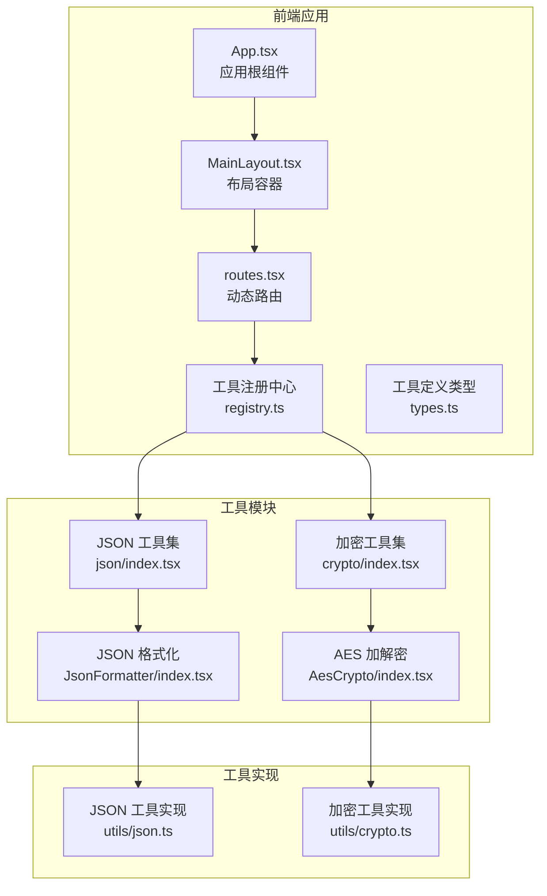
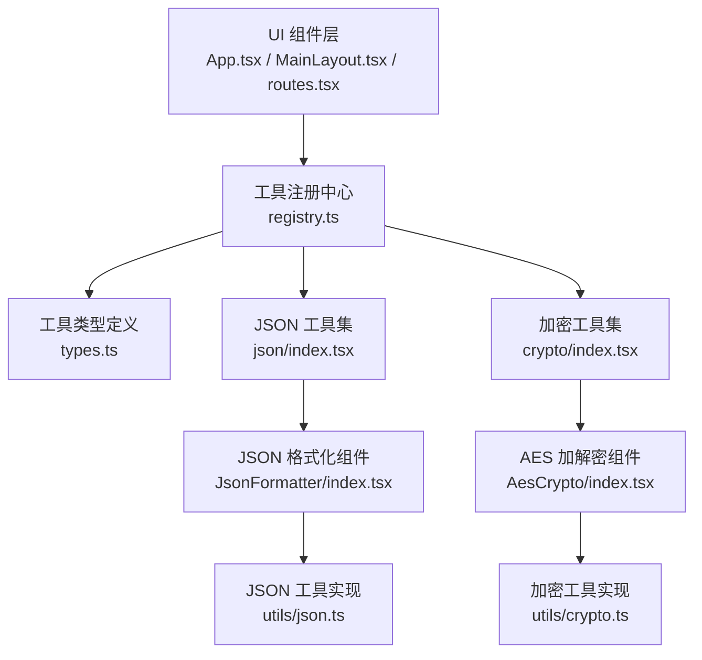
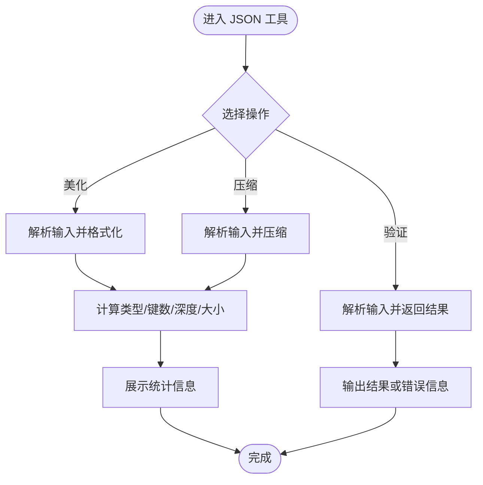
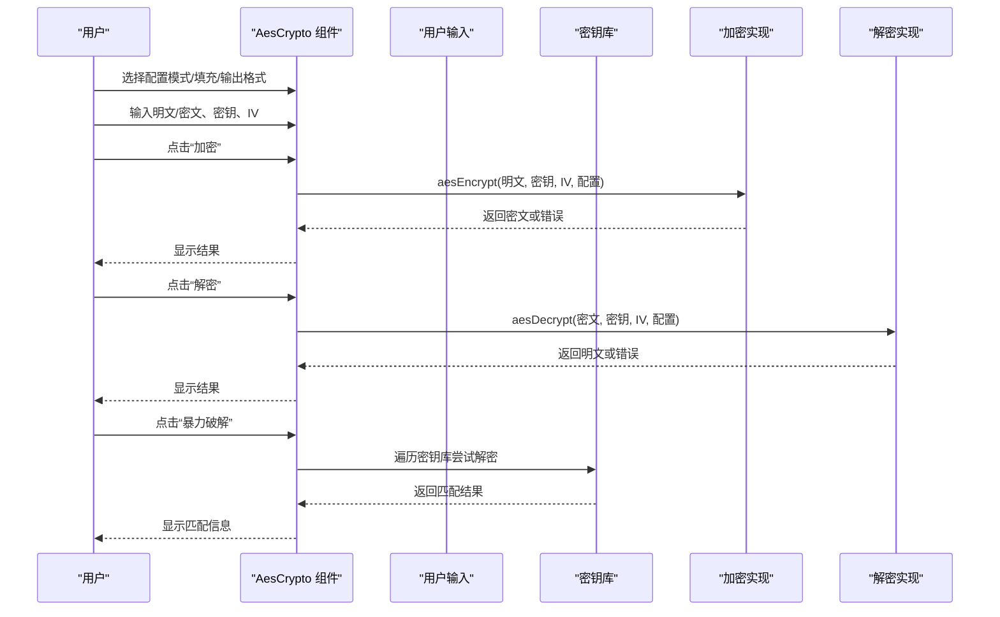
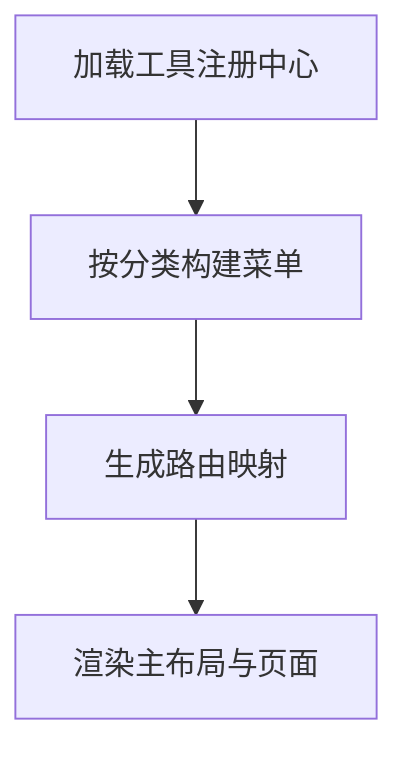
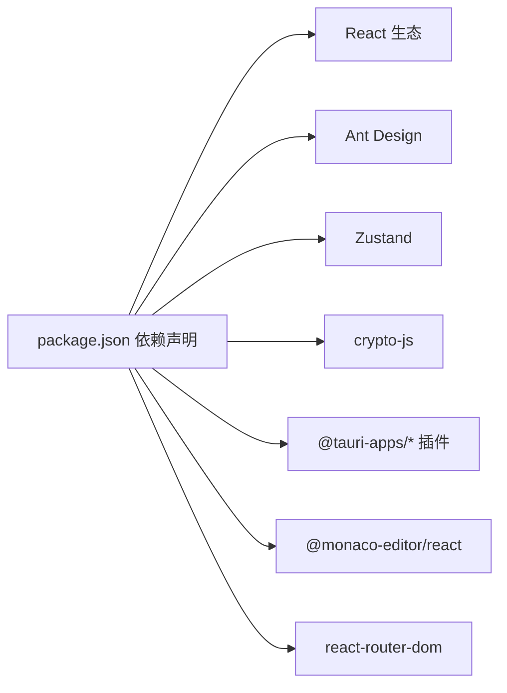

# 项目介绍

<cite>
**本文引用的文件**
- [package.json](file://package.json)
- [src/main.tsx](file://src/main.tsx)
- [src/App.tsx](file://src/App.tsx)
- [src/routes.tsx](file://src/routes.tsx)
- [src/layouts/MainLayout.tsx](file://src/layouts/MainLayout.tsx)
- [src/tools/registry.ts](file://src/tools/registry.ts)
- [src/tools/types.ts](file://src/tools/types.ts)
- [src/tools/json/index.tsx](file://src/tools/json/index.tsx)
- [src/tools/crypto/index.tsx](file://src/tools/crypto/index.tsx)
- [src/tools/json/JsonFormatter/index.tsx](file://src/tools/json/JsonFormatter/index.tsx)
- [src/tools/crypto/AesCrypto/index.tsx](file://src/tools/crypto/AesCrypto/index.tsx)
- [src/utils/json.ts](file://src/utils/json.ts)
- [src/utils/crypto.ts](file://src/utils/crypto.ts)
- [src/constants/changelog.ts](file://src/constants/changelog.ts)
- [src/store/useAppStore.ts](file://src/store/useAppStore.ts)
</cite>

## 目录
1. [简介](#简介)
2. [项目结构](#项目结构)
3. [核心组件](#核心组件)
4. [架构总览](#架构总览)
5. [详细组件分析](#详细组件分析)
6. [依赖关系分析](#依赖关系分析)
7. [性能考虑](#性能考虑)
8. [故障排查指南](#故障排查指南)
9. [结论](#结论)
10. [附录](#附录)

## 简介
XKUtil 是一款面向开发者的桌面工具箱应用，基于 Tauri + React 技术栈构建，提供本地化的数据处理与安全工具能力。其核心价值在于：
- 将常用的数据处理与加密解密任务从浏览器或在线工具迁移至本地，提升安全性与隐私性；
- 提供开箱即用的工具模块，减少重复造轮子的成本，提高开发与测试效率；
- 通过直观的界面与可扩展的工具注册机制，满足不同场景下的快速验证与转换需求。

目标用户群体：
- 后端/前端工程师：进行接口调试、配置文件处理、日志解析与数据校验；
- 安全工程师：进行加解密算法验证、密钥与参数对比；
- 测试工程师：在本地快速生成/验证 JSON、进行加密数据的还原与比对；
- 运维工程师：处理配置文件、日志与密文的本地化转换与校验。

主要功能定位：
- JSON 工具：提供 JSON 美化、压缩、验证与树形视图，辅助开发者高效处理结构化数据；
- 加密工具：提供 AES 加密/解密、密钥库管理、暴力破解辅助等功能，满足本地化安全验证需求。

应用场景举例：
- 在接口联调中，快速美化/压缩 JSON 请求体与响应体，便于阅读与传输；
- 在安全测试中，验证不同模式与填充方式下的加解密结果，辅助定位配置问题；
- 在配置管理中，对敏感字段进行本地化加解密与回显，避免泄露。

版本信息与开发状态：
- 当前版本：0.2.0（2026-05-16 发布）
- 开发状态：稳定可用的桌面应用，具备基础工具与本地化特性；后续计划围绕工具扩展与用户体验优化持续迭代。

未来规划方向（基于当前版本能力与设计）：
- 扩展更多加密算法与编解码工具；
- 增强工具间的联动与批量处理能力；
- 优化主题与国际化支持；
- 引入更多实用工具模块，如网络工具、文本处理等。

**章节来源**
- [package.json:1-36](file://package.json#L1-L36)
- [src/constants/changelog.ts:1-34](file://src/constants/changelog.ts#L1-L34)

## 项目结构
XKUtil 采用前端模块化与工具注册机制相结合的组织方式：
- 前端层：React + Ant Design + Zustand 状态管理，负责 UI 展示与交互；
- 工具层：按功能域划分（JSON、加密等），每个工具独立实现并注册到统一入口；
- 工具注册中心：集中管理工具分类与路由映射；
- 路由层：动态根据工具注册表生成页面路由；
- 布局层：侧边菜单、头部操作区与版本信息展示；
- 工具实现：各工具内部包含配置面板、输入输出面板与操作按钮，部分工具提供密钥库与暴力破解辅助能力。

**图表来源**
- [src/App.tsx:1-24](file://src/App.tsx#L1-L24)
- [src/layouts/MainLayout.tsx:1-168](file://src/layouts/MainLayout.tsx#L1-L168)
- [src/routes.tsx:1-29](file://src/routes.tsx#L1-L29)
- [src/tools/registry.ts:1-39](file://src/tools/registry.ts#L1-L39)
- [src/tools/types.ts:1-20](file://src/tools/types.ts#L1-L20)
- [src/tools/json/index.tsx:1-27](file://src/tools/json/index.tsx#L1-L27)
- [src/tools/crypto/index.tsx:1-17](file://src/tools/crypto/index.tsx#L1-L17)
- [src/tools/json/JsonFormatter/index.tsx:1-267](file://src/tools/json/JsonFormatter/index.tsx#L1-L267)
- [src/tools/crypto/AesCrypto/index.tsx:1-310](file://src/tools/crypto/AesCrypto/index.tsx#L1-L310)
- [src/utils/json.ts:1-116](file://src/utils/json.ts#L1-L116)
- [src/utils/crypto.ts:1-222](file://src/utils/crypto.ts#L1-L222)

**章节来源**
- [src/main.tsx:1-11](file://src/main.tsx#L1-L11)
- [src/App.tsx:1-24](file://src/App.tsx#L1-L24)
- [src/routes.tsx:1-29](file://src/routes.tsx#L1-L29)
- [src/tools/registry.ts:1-39](file://src/tools/registry.ts#L1-L39)
- [src/tools/types.ts:1-20](file://src/tools/types.ts#L1-L20)

## 核心组件
- 应用根组件与主题配置：负责初始化路由、语言与主题，并挂载主布局与路由出口。
- 主布局：包含侧边菜单（按工具分类与工具项）、顶部操作区（折叠/切换主题）、内容区域与版本弹窗。
- 动态路由：根据工具注册中心生成的工具列表，自动渲染对应页面组件。
- 工具注册中心：聚合所有工具，按分类组织并提供分类名称映射。
- JSON 工具：提供美化、压缩、验证与统计信息展示，支持排序键、缩进与粘贴/复制等便捷操作。
- 加密工具（AES）：支持多种模式与填充、输出格式选择、密钥/IV 校验、密钥库管理与暴力破解辅助。

**章节来源**
- [src/App.tsx:1-24](file://src/App.tsx#L1-L24)
- [src/layouts/MainLayout.tsx:1-168](file://src/layouts/MainLayout.tsx#L1-L168)
- [src/routes.tsx:1-29](file://src/routes.tsx#L1-L29)
- [src/tools/registry.ts:1-39](file://src/tools/registry.ts#L1-L39)
- [src/tools/json/JsonFormatter/index.tsx:1-267](file://src/tools/json/JsonFormatter/index.tsx#L1-L267)
- [src/tools/crypto/AesCrypto/index.tsx:1-310](file://src/tools/crypto/AesCrypto/index.tsx#L1-L310)

## 架构总览
XKUtil 的整体架构遵循“前端模块化 + 工具注册 + 动态路由”的设计思路，确保工具扩展与维护成本低、复用性强。

**图表来源**
- [src/App.tsx:1-24](file://src/App.tsx#L1-L24)
- [src/layouts/MainLayout.tsx:1-168](file://src/layouts/MainLayout.tsx#L1-L168)
- [src/routes.tsx:1-29](file://src/routes.tsx#L1-L29)
- [src/tools/registry.ts:1-39](file://src/tools/registry.ts#L1-L39)
- [src/tools/types.ts:1-20](file://src/tools/types.ts#L1-L20)
- [src/tools/json/index.tsx:1-27](file://src/tools/json/index.tsx#L1-L27)
- [src/tools/crypto/index.tsx:1-17](file://src/tools/crypto/index.tsx#L1-L17)
- [src/tools/json/JsonFormatter/index.tsx:1-267](file://src/tools/json/JsonFormatter/index.tsx#L1-L267)
- [src/tools/crypto/AesCrypto/index.tsx:1-310](file://src/tools/crypto/AesCrypto/index.tsx#L1-L310)
- [src/utils/json.ts:1-116](file://src/utils/json.ts#L1-L116)
- [src/utils/crypto.ts:1-222](file://src/utils/crypto.ts#L1-L222)

## 详细组件分析

### JSON 工具模块
JSON 工具模块包含“格式化”和“树形视图”两个子工具，前者提供美化、压缩、验证与统计信息展示，后者以树形结构可视化 JSON 数据。

**图表来源**
- [src/tools/json/JsonFormatter/index.tsx:53-130](file://src/tools/json/JsonFormatter/index.tsx#L53-L130)
- [src/utils/json.ts:14-38](file://src/utils/json.ts#L14-L38)
- [src/utils/json.ts:40-52](file://src/utils/json.ts#L40-L52)
- [src/utils/json.ts:71-91](file://src/utils/json.ts#L71-L91)

典型使用场景：
- 在接口调试中，将难以阅读的压缩 JSON 美化为易读格式；
- 对配置文件进行压缩以减小体积；
- 快速验证 JSON 是否合法并查看结构统计信息。

**章节来源**
- [src/tools/json/index.tsx:1-27](file://src/tools/json/index.tsx#L1-L27)
- [src/tools/json/JsonFormatter/index.tsx:1-267](file://src/tools/json/JsonFormatter/index.tsx#L1-L267)
- [src/utils/json.ts:1-116](file://src/utils/json.ts#L1-L116)

### 加密工具（AES）模块
AES 工具提供加密、解密、暴力破解辅助与密钥库管理能力，支持多种模式、填充与输出格式，并对密钥与 IV 进行严格长度校验。

**图表来源**
- [src/tools/crypto/AesCrypto/index.tsx:55-112](file://src/tools/crypto/AesCrypto/index.tsx#L55-L112)
- [src/utils/crypto.ts:59-105](file://src/utils/crypto.ts#L59-L105)
- [src/utils/crypto.ts:107-162](file://src/utils/crypto.ts#L107-L162)
- [src/utils/crypto.ts:202-222](file://src/utils/crypto.ts#L202-L222)

典型使用场景：
- 在安全测试中验证不同模式与填充下的加解密行为；
- 使用密钥库保存多套密钥对，快速切换进行对比；
- 通过暴力破解辅助功能快速定位正确的密钥与配置。

**章节来源**
- [src/tools/crypto/index.tsx:1-17](file://src/tools/crypto/index.tsx#L1-L17)
- [src/tools/crypto/AesCrypto/index.tsx:1-310](file://src/tools/crypto/AesCrypto/index.tsx#L1-L310)
- [src/utils/crypto.ts:1-222](file://src/utils/crypto.ts#L1-L222)

### 工具注册与路由
工具注册中心将 JSON 与加密工具统一管理，并按分类生成菜单项；动态路由根据注册表自动生成页面路径，确保新增工具无需手动修改路由配置。

**图表来源**
- [src/tools/registry.ts:7-23](file://src/tools/registry.ts#L7-L23)
- [src/routes.tsx:6-28](file://src/routes.tsx#L6-L28)
- [src/layouts/MainLayout.tsx:31-43](file://src/layouts/MainLayout.tsx#L31-L43)

**章节来源**
- [src/tools/registry.ts:1-39](file://src/tools/registry.ts#L1-L39)
- [src/routes.tsx:1-29](file://src/routes.tsx#L1-L29)
- [src/layouts/MainLayout.tsx:1-168](file://src/layouts/MainLayout.tsx#L1-L168)

## 依赖关系分析
- 前端框架与 UI：React、Ant Design、@ant-design/icons；
- 编辑器与路由：@monaco-editor/react、react-router-dom；
- 状态管理：zustand（持久化存储应用设置）；
- 加解密：crypto-js；
- Tauri 插件：clipboard-manager、dialog、fs；
- TypeScript 与 Vite 构建工具链。

**图表来源**
- [package.json:12-34](file://package.json#L12-L34)

**章节来源**
- [package.json:1-36](file://package.json#L1-L36)

## 性能考虑
- 工具组件采用懒加载与分割器布局，保证大文本输入输出时的流畅体验；
- JSON 工具在解析与统计时避免不必要的深拷贝，复杂度与输入规模线性相关；
- 加密工具在解密失败时尽早返回错误，减少无效计算；
- 建议在处理超大 JSON 或密文时分段处理，避免长时间阻塞 UI。

## 故障排查指南
常见问题与处理建议：
- JSON 解析失败：检查输入是否为合法 JSON，关注错误位置提示并修正语法；
- AES 密钥/IV 长度不匹配：确认密钥与 IV 的格式与长度要求，Hex 模式下需满足固定字符长度；
- 解密结果为空：检查模式、填充与输出格式是否一致，确认密钥与 IV 正确；
- 暴力破解无结果：确认密钥库中存在有效密钥对，且密文与配置匹配。

**章节来源**
- [src/tools/json/JsonFormatter/index.tsx:60-78](file://src/tools/json/JsonFormatter/index.tsx#L60-L78)
- [src/utils/json.ts:14-38](file://src/utils/json.ts#L14-L38)
- [src/utils/crypto.ts:67-73](file://src/utils/crypto.ts#L67-L73)
- [src/utils/crypto.ts:115-121](file://src/utils/crypto.ts#L115-L121)
- [src/utils/crypto.ts:154-156](file://src/utils/crypto.ts#L154-L156)

## 结论
XKUtil 通过简洁的架构与明确的功能边界，为开发者提供了本地化的数据处理与安全验证工具。JSON 工具与加密工具两大模块覆盖了日常开发中的高频场景，配合动态路由与工具注册机制，具备良好的可扩展性与维护性。随着版本迭代，XKUtil 将持续引入更多实用工具，进一步提升开发效率与安全性。

## 附录
- 版本与更新日志：参考变更记录，了解功能演进与修复内容；
- 主题与设置：支持亮/暗主题切换与设置持久化；
- 本地化与隐私：所有处理在本地完成，避免敏感数据上传云端。

**章节来源**
- [src/constants/changelog.ts:1-34](file://src/constants/changelog.ts#L1-L34)
- [src/store/useAppStore.ts:1-24](file://src/store/useAppStore.ts#L1-L24)
- [src/layouts/MainLayout.tsx:95-164](file://src/layouts/MainLayout.tsx#L95-L164)