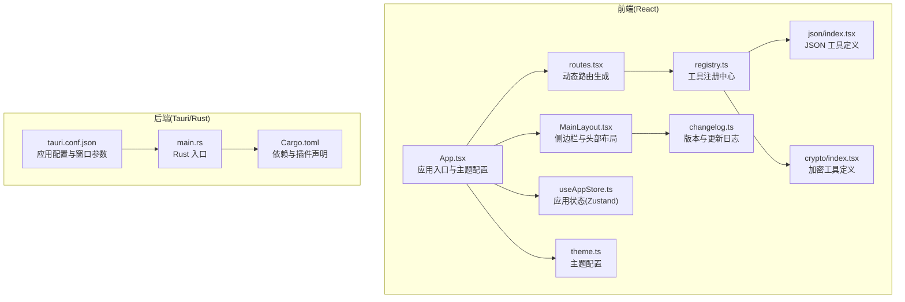
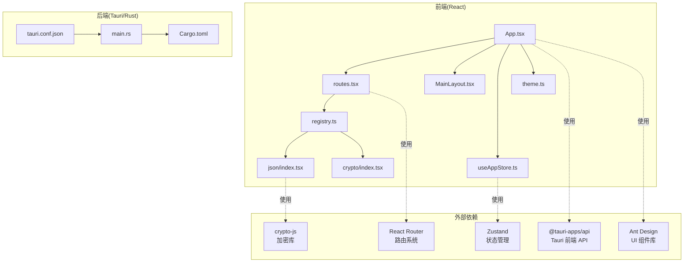
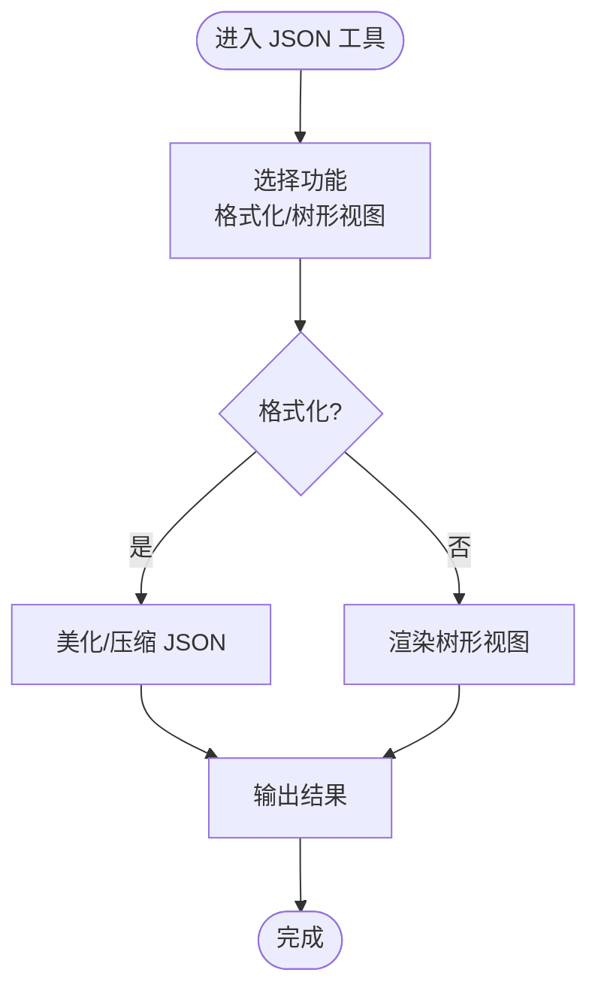
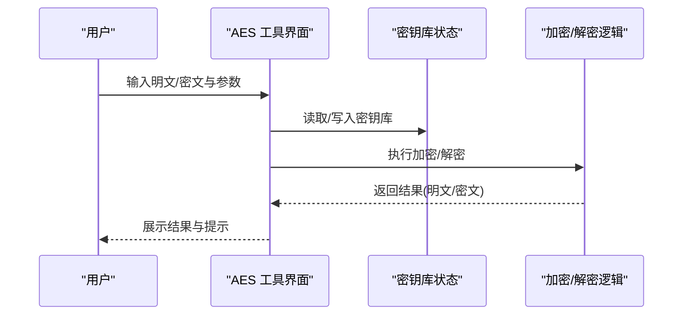
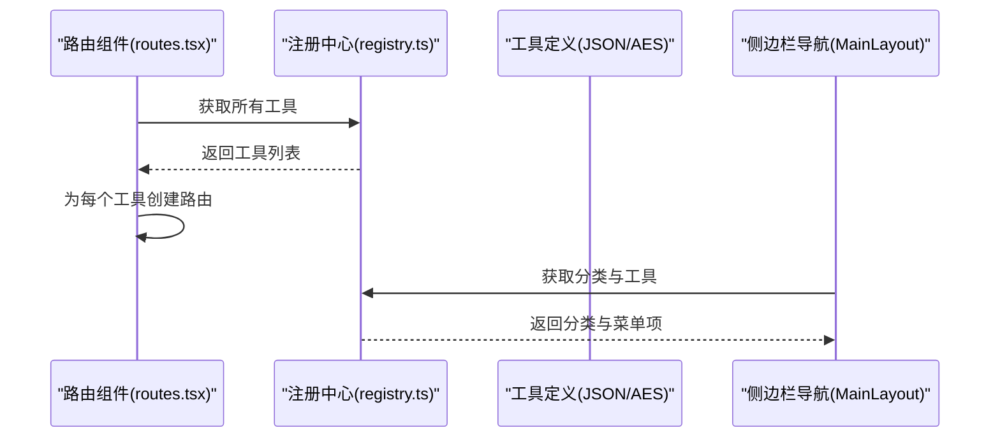
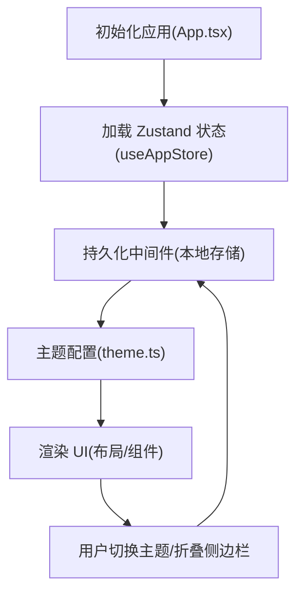
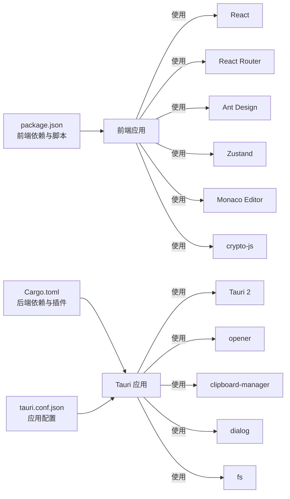

# 项目概述

<cite>
**本文档引用的文件**
- [package.json](file://package.json)
- [Cargo.toml](file://src-tauri/Cargo.toml)
- [App.tsx](file://src/App.tsx)
- [main.tsx](file://src/main.tsx)
- [routes.tsx](file://src/routes.tsx)
- [MainLayout.tsx](file://src/layouts/MainLayout.tsx)
- [registry.ts](file://src/tools/registry.ts)
- [types.ts](file://src/tools/types.ts)
- [json/index.tsx](file://src/tools/json/index.tsx)
- [crypto/index.tsx](file://src/tools/crypto/index.tsx)
- [useAppStore.ts](file://src/store/useAppStore.ts)
- [theme.ts](file://src/styles/theme.ts)
- [changelog.ts](file://src/constants/changelog.ts)
- [tauri.conf.json](file://src-tauri/tauri.conf.json)
- [main.rs](file://src-tauri/src/main.rs)
</cite>

## 目录
1. [引言](#引言)
2. [项目结构](#项目结构)
3. [核心组件](#核心组件)
4. [架构总览](#架构总览)
5. [详细组件分析](#详细组件分析)
6. [依赖关系分析](#依赖关系分析)
7. [性能考虑](#性能考虑)
8. [故障排除指南](#故障排除指南)
9. [结论](#结论)
10. [附录](#附录)

## 引言
XKUtil 是一款面向开发者的跨平台桌面应用工具箱，旨在为日常开发工作提供便捷的工具集。项目采用 Tauri + React 技术栈，结合 Rust 后端与现代前端框架，实现高性能、低资源占用的桌面应用体验。应用的核心定位是“开发者工具箱”，当前已覆盖两大核心模块：JSON 工具与加密工具，并通过可扩展的工具注册机制支持未来功能拓展。

- JSON 工具：提供 JSON 格式化、压缩、校验与树形可视化能力，帮助开发者快速检查与理解复杂数据结构。
- 加密工具：提供 AES 加解密功能，支持多种分组密码模式与填充方式，内置密钥库管理与暴力破解辅助能力，满足开发与测试场景下的加解密需求。

项目通过 Ant Design 作为 UI 组件库，Zustand 实现轻量级状态管理，React Router 提供路由系统，Tauri 负责与操作系统交互与打包分发。整体设计强调易用性与可扩展性，既适合初学者快速上手，也为有经验的开发者提供了清晰的扩展点。

## 项目结构
项目采用前后端分离但紧密集成的组织方式：
- 前端（React + TypeScript）位于 src 目录，负责用户界面、路由、状态管理与工具组件。
- 后端（Rust + Tauri）位于 src-tauri 目录，负责应用生命周期、系统权限与原生能力封装。
- 工具注册中心统一管理工具分类与路由映射，便于按需扩展新工具。

图表来源
- [App.tsx:1-24](file://src/App.tsx#L1-L24)
- [routes.tsx:1-29](file://src/routes.tsx#L1-L29)
- [MainLayout.tsx:1-168](file://src/layouts/MainLayout.tsx#L1-L168)
- [useAppStore.ts:1-24](file://src/store/useAppStore.ts#L1-L24)
- [registry.ts:1-39](file://src/tools/registry.ts#L1-L39)
- [json/index.tsx:1-27](file://src/tools/json/index.tsx#L1-L27)
- [crypto/index.tsx:1-17](file://src/tools/crypto/index.tsx#L1-L17)
- [theme.ts:1-12](file://src/styles/theme.ts#L1-L12)
- [changelog.ts:1-34](file://src/constants/changelog.ts#L1-L34)
- [tauri.conf.json:1-39](file://src-tauri/tauri.conf.json#L1-L39)
- [main.rs:1-6](file://src-tauri/src/main.rs#L1-L6)
- [Cargo.toml:1-23](file://src-tauri/Cargo.toml#L1-L23)

章节来源
- [package.json:1-36](file://package.json#L1-L36)
- [Cargo.toml:1-23](file://src-tauri/Cargo.toml#L1-L23)
- [tauri.conf.json:1-39](file://src-tauri/tauri.conf.json#L1-L39)

## 核心组件
- 应用入口与主题配置：应用在入口处完成 Ant Design 的本地化与主题注入，并通过 Zustand 管理全局状态（如侧边栏折叠与主题切换），确保主题与布局的一致性。
- 动态路由系统：通过工具注册中心收集所有工具定义，自动生成路由表，支持懒加载与错误回退到首个工具页面。
- 主布局与导航：侧边栏根据工具分类动态生成菜单项，顶部提供主题切换与侧边栏折叠控制，底部显示版本信息与更新日志弹窗。
- 工具注册中心：将 JSON 与加密工具按类别聚合，提供分类名称映射与工具集合查询接口，便于扩展新的工具类型。
- 状态管理：使用 Zustand 管理应用设置（如主题、侧边栏折叠），并通过持久化中间件将设置保存至本地存储。
- 主题系统：基于 Ant Design 的算法与 Token 配置，支持亮色与暗色主题切换，并持久化用户偏好。

章节来源
- [App.tsx:1-24](file://src/App.tsx#L1-L24)
- [routes.tsx:1-29](file://src/routes.tsx#L1-L29)
- [MainLayout.tsx:1-168](file://src/layouts/MainLayout.tsx#L1-L168)
- [registry.ts:1-39](file://src/tools/registry.ts#L1-L39)
- [types.ts:1-20](file://src/tools/types.ts#L1-L20)
- [useAppStore.ts:1-24](file://src/store/useAppStore.ts#L1-L24)
- [theme.ts:1-12](file://src/styles/theme.ts#L1-L12)

## 架构总览
XKUtil 的整体架构围绕“前端 React 应用 + 后端 Tauri/Rust”展开，前端负责 UI 与业务逻辑，后端负责系统集成与安全策略。应用通过 Tauri 的能力配置与插件系统，按需启用文件系统、剪贴板、对话框等原生能力；同时通过配置文件集中管理窗口尺寸、最小尺寸与图标资源，确保跨平台一致的用户体验。

图表来源
- [App.tsx:1-24](file://src/App.tsx#L1-L24)
- [routes.tsx:1-29](file://src/routes.tsx#L1-L29)
- [MainLayout.tsx:1-168](file://src/layouts/MainLayout.tsx#L1-L168)
- [useAppStore.ts:1-24](file://src/store/useAppStore.ts#L1-L24)
- [registry.ts:1-39](file://src/tools/registry.ts#L1-L39)
- [json/index.tsx:1-27](file://src/tools/json/index.tsx#L1-L27)
- [crypto/index.tsx:1-17](file://src/tools/crypto/index.tsx#L1-L17)
- [theme.ts:1-12](file://src/styles/theme.ts#L1-L12)
- [tauri.conf.json:1-39](file://src-tauri/tauri.conf.json#L1-L39)
- [main.rs:1-6](file://src-tauri/src/main.rs#L1-L6)
- [Cargo.toml:1-23](file://src-tauri/Cargo.toml#L1-L23)
- [package.json:12-25](file://package.json#L12-L25)

## 详细组件分析

### JSON 工具模块
JSON 工具模块提供两类核心能力：
- JSON 格式化：支持美化、压缩与校验，便于开发者快速阅读与传输。
- JSON 树形视图：以树形结构可视化展示 JSON 数据，提升复杂结构的理解效率。

图表来源
- [json/index.tsx:1-27](file://src/tools/json/index.tsx#L1-L27)

章节来源
- [json/index.tsx:1-27](file://src/tools/json/index.tsx#L1-L27)

### 加密工具模块（AES）
加密工具模块聚焦于 AES 加解密，具备以下特性：
- 多模式支持：ECB、CBC、CFB、OFB、CTR 等常见分组密码模式。
- 多填充支持：PKCS7、ZeroPadding、NoPadding 等填充方式。
- 多输出格式：Base64 与 Hex 输出，适配不同场景的数据传输需求。
- 密钥库管理：支持保存、编辑与删除密钥对，便于重复使用常用密钥。
- 暴力破解辅助：遍历密钥库尝试解密，辅助调试与测试场景。

图表来源
- [crypto/index.tsx:1-17](file://src/tools/crypto/index.tsx#L1-L17)

章节来源
- [crypto/index.tsx:1-17](file://src/tools/crypto/index.tsx#L1-L17)

### 路由与工具注册
应用通过工具注册中心统一管理工具定义与分类，动态生成路由表，实现“所见即所得”的工具导航与懒加载优化。

图表来源
- [routes.tsx:1-29](file://src/routes.tsx#L1-L29)
- [registry.ts:1-39](file://src/tools/registry.ts#L1-L39)
- [MainLayout.tsx:1-168](file://src/layouts/MainLayout.tsx#L1-L168)

章节来源
- [routes.tsx:1-29](file://src/routes.tsx#L1-L29)
- [registry.ts:1-39](file://src/tools/registry.ts#L1-L39)
- [types.ts:1-20](file://src/tools/types.ts#L1-L20)

### 状态管理与主题系统
应用使用 Zustand 管理应用设置（如主题与侧边栏折叠），并通过持久化中间件将设置保存到本地存储，保证重启后仍保持用户偏好。主题系统基于 Ant Design 的算法与 Token 配置，支持亮色与暗色主题切换。

图表来源
- [App.tsx:1-24](file://src/App.tsx#L1-L24)
- [useAppStore.ts:1-24](file://src/store/useAppStore.ts#L1-L24)
- [theme.ts:1-12](file://src/styles/theme.ts#L1-L12)

章节来源
- [useAppStore.ts:1-24](file://src/store/useAppStore.ts#L1-L24)
- [theme.ts:1-12](file://src/styles/theme.ts#L1-L12)

## 依赖关系分析
- 前端依赖：React、React Router、Ant Design、Zustand、Monaco Editor、crypto-js 等，分别用于 UI 构建、路由、状态管理、代码编辑与加密计算。
- 后端依赖：Tauri 2 及其插件（opener、clipboard-manager、dialog、fs），用于系统集成与原生能力访问。
- 构建与脚本：Vite、TypeScript、Tauri CLI，负责开发、构建与打包流程。

图表来源
- [package.json:12-34](file://package.json#L12-L34)
- [Cargo.toml:15-22](file://src-tauri/Cargo.toml#L15-L22)
- [tauri.conf.json:1-39](file://src-tauri/tauri.conf.json#L1-L39)

章节来源
- [package.json:12-34](file://package.json#L12-L34)
- [Cargo.toml:15-22](file://src-tauri/Cargo.toml#L15-L22)

## 性能考虑
- 懒加载与按需渲染：工具组件通过 React.lazy 与 Suspense 实现懒加载，减少首屏加载时间。
- 轻量状态管理：Zustand 无样板代码，避免不必要的重渲染，适合小型到中型应用的状态管理。
- 主题与布局：Ant Design 的算法与 Token 配置在运行时计算，建议在主题切换时避免频繁触发大范围重绘。
- 原生能力：Tauri 插件按需启用，避免引入未使用的系统权限与资源消耗。

## 故障排除指南
- 路由异常或空白页：检查工具注册中心是否正确返回工具列表，确认路由生成逻辑与默认跳转路径。
- 主题不生效：确认主题配置函数与 Ant Design 的 ConfigProvider 正确传入，检查持久化状态是否被意外清空。
- 更新日志弹窗无法打开：检查布局组件中的状态开关与事件绑定，确认版本号与变更记录数据结构正确。
- 构建或预览失败：核对 Tauri 配置文件中的前端构建产物路径与开发服务器地址，确保 Vite 与 Tauri CLI 版本兼容。

章节来源
- [routes.tsx:1-29](file://src/routes.tsx#L1-L29)
- [MainLayout.tsx:1-168](file://src/layouts/MainLayout.tsx#L1-L168)
- [changelog.ts:1-34](file://src/constants/changelog.ts#L1-L34)
- [tauri.conf.json:5-10](file://src-tauri/tauri.conf.json#L5-L10)

## 结论
XKUtil 通过 Tauri + React 的组合，实现了跨平台桌面应用的高效开发与部署。项目以“开发者工具箱”为核心定位，当前已提供 JSON 工具与加密工具两大模块，并通过注册中心与动态路由体系为后续扩展预留了清晰的接口。前端采用现代化技术栈，后端借助 Tauri 的原生能力与安全策略，兼顾易用性与可维护性。对于初学者，项目提供了直观的 UI 与明确的功能边界；对于有经验的开发者，项目展示了可扩展的架构与模块化设计思路。

## 附录
- 技术栈概览
  - 前端：React、React Router、Ant Design、Zustand、Monaco Editor、crypto-js
  - 后端：Tauri 2、Rust、相关插件（opener、clipboard-manager、dialog、fs）
  - 构建：Vite、TypeScript、Tauri CLI
- 项目特色功能
  - JSON 工具：格式化、压缩、校验、树形视图
  - 加密工具：AES 多模式、多填充、多输出格式、密钥库管理、暴力破解辅助
  - 主题与布局：亮/暗主题切换、侧边栏折叠、版本更新日志弹窗
- 跨平台实现原理
  - 前端构建产物由 Tauri 在打包阶段嵌入，运行时通过 Tauri API 访问系统能力，窗口尺寸与图标在配置文件中集中管理，确保 Windows、macOS、Linux 平台一致性